## Welcome to our IT world
<h1>1.Team Profile</h1>

Our team name called High Flash which named by Zijie Luo. Actually we don’t get it what is that meaning, but anyway it sounds good. Also it may make others easy to focus and interest in our group.

<h2>Personal Information</h2>
Name: Yifei Wang 
Student number: S3727607 
Email: 3727607@student.rmit.edu.au 
Description：I am an international student at RMIT, I have been in Australia for three years. You might know I came from China through my name, and yes I spoke Chinese. You know China has a long history, but we do use modern technical! 
 
 
Name: Nuozehua Li 
Student number: S3701549 
Email: 37015497@student.rmit.edu.au 

 
Description：I come from JiangSu China, in my hometown, there are many famous scenic spots such as natural caves and bamboo forests. 
I have been in Melbourne for a year, I graduated from diploma and start my bachelor life now. I can speak Chinese, English, but my English still not very good. About my hobbies, I like playing games in my free time. I also like listening to music when I read books, it can make me relax. 
 
 
Name: Hai Minh Khue Ta, Kaylee 
Student number: S3785151 
Email: “kaylee0901@icloud.com” 
Description: I come from Vietnam, so obviously I can speak Vietnamese. I am a freshman of Bachelor of Information Technology. I came to Australia about 3 years ago. Fun fact: I have a cat which is named Theodore and I love it. 
 
 
Name: Haizhou Cheng, Eric 
Student number: s3622097 
Email: 81996862gmail.com 
 
Description: Hi, my name is Haizhou Cheng, you also can call me Eric.I come from China, Shenzhen, which is the first economic zone in China. Because I am Chinese so my first language is Chinese, I am doing undergraduate about Information Technology in RMIT. This is my first time learning knowledge in university and also this is my first time learning something by using English. I am a person with a wide range of interests, I like sport, I can swim, play basketball, table tennis, billiards and so on. Even though I am not really good at it but still enjoy it. Also I really love card, I play all the things contain card, for example poker card game and poke card trick, magic the gathering game, Hearthstone. Next of course is video game. My favourite game is League of legend, second favourite is Blizzard game. 
 
 
Name: Zijie Luo, Damon 
Student number: s3809908 
Email: s3809908@student.rmit.edu.au 
Description: Hello everyone, let me introduce myself here briefly, I am Zijie Luo from China, you can also call me Damon, now I am studying at RMIT University, majoring in IT courses, my students number is s3809908 and the email address is s3809908@student.rmit.edu.au. If you want to make friends or have any questions, you can contact me via this email address. In fact, I have a small hobby that I especially like cats. I have three cats in China. After I came here, I also have two cats at home. I think cats are good friends of human beings. Getting along with them can make our lives full. pleasure. 
 
<h2>Team profile</h2>
<h5>Name: Zijie Luo</h5>  
<a>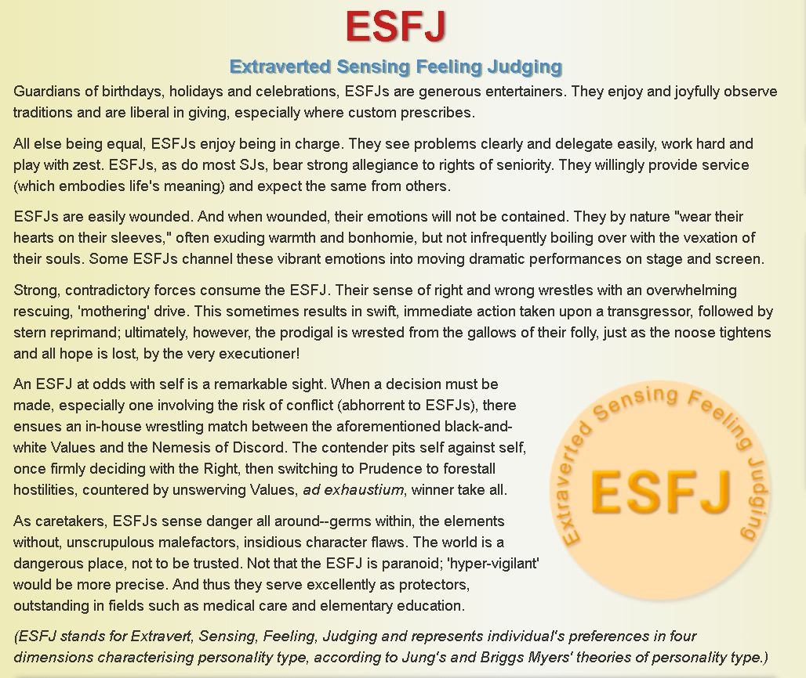</a>
<a>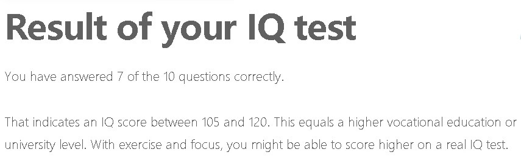</a> 
The first test proved that I am a protector who likes to take charge of things and be enthusiastic.
The second test proved that I am a visual learner. I usually understand and learn things through vision, and I can easily attract attention with rich image colors and sounds. 
The third is an intelligence test. The result of the test is that my IQ is between 105 and 120, which is equivalent to the normal college level. 
Summarizing the results of these three tests, I am a person who can be seriously responsible in the team, will complete their tasks on time and can help others, but in the team work may be affected by other things, when forming the team I need a strong leader to supervise me, and I can be the one who helps the leader manage the team. 
   
   
  <h5>Name: Kaylee</h5> 
    1. Myers-Briggs test: Mind: Introvert 53%, Energy: Observant 54%, Nature: Feeling 65%, Tactics: Prospecting 58%, Identity: Turbulent: 64% 
    2. Learning Style test: Auditory: 25%, Visual: 40%, Tactile: 35%  
    3. Big Five Personality test: Extraversion 42%, Agreeableness 67%, Conscientiousness 84%, Neuroticism 40%, Openness 60%. 
These tests tell me what is my personality, and what is my learning type is. I am likely to be an introvert. This may affect my teamwork ability. However, this is a challenge for me to get over myself. With my conscientiousness, I will try my best to do all my work as a team. 
   
   
 <h5> Name: Jason</h5> 
  The results of an online Myers-Briggs test: 
  <a>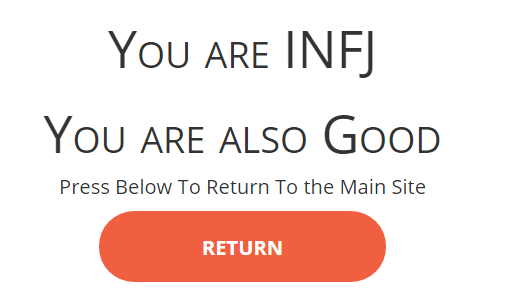</a> 
  The results of an online learning style test: 
   <a>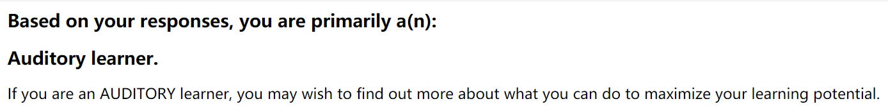</a> 
   The results of one further online test: 
O = Openness, C = Conscientiousness, E = Extraversion, A = greeableness, N = Neuroticism 
  <a>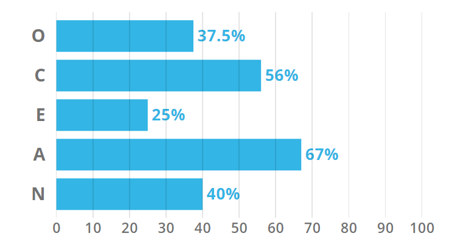</a> 
I think some opinions in the results of these tests are true for me, but not all. Maybe as the results show I’m auditory learner, so I will pay attention to this and more use this way to study in the future. The result also show I'm introverted and I admit it, this is one of the drawbacks for me, but l will try to get over it. There are all results mean for me: keep going and develop myself. 
Different people have different personalities, these personality must influence the behavior when they are working as a team; For example, I’m introverted, this will influence the team communication in a team; if you are a sense of responsibility and easy-going, people will like to work with you. 
If I’m the team manager, I will assign different tasks to people who have different personalities. If people who are outgoing, these people usually have communication and language skills, so they are Suitable to be a diplomat; If people who are introverted, these kind of people always have a sense of responsibility and work very hard in the team. So they are suitable to be a staff such as programmer. That is my opinion. 
 
 
 <h5> Name: Eric</h5> 
 <a>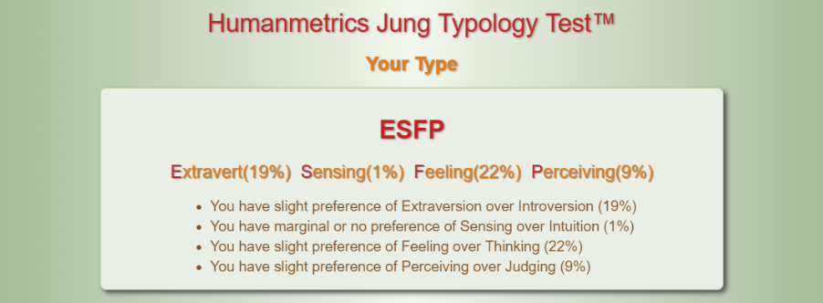</a> 
 <a>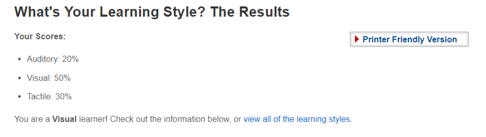</a> 
 <a>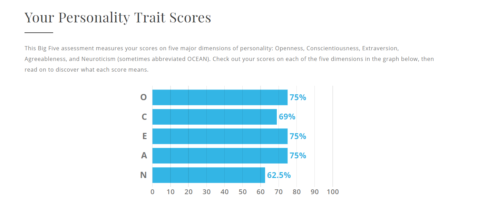</a> 
 Although these data can not represent my real person, it is indeed a reference indicator for me. In my opinion, this data allows me to understand myself more specifically. As the learning test shows, I am a visual learner. I fully agree with this point. There is no way for my subconscious to grasp the abstract things. But if it is a very specific thing, then I will remember or learn very quickly. For example, I chose IT instead of business haha! Those abstract theories are more difficult to understand and learn than actual code. 
The structure of a team is simply the leader and the team members. After the leader receives the task and discuss with the group member and then assigns the task, the leader needs experience and determination. He needs to make the right choices right away from his experience, and he can't hesitate to let the team members question the task and slow down the work. The team members need to do the assigned work well and meet the mission requirements. They cannot slow down the whole project because they are slow. This requires patience and seriousness. So I may be more suitable for team members at the moment, and carefully assign the assigned tasks.
So when teaming up, I might need to find an experienced and determined leader and do the assignment. Let me play my abilities better. 
 
 
 <h5> Name: Haizhou Cheng</h5> 
 The results of Myers-Briggs test: 
  <a>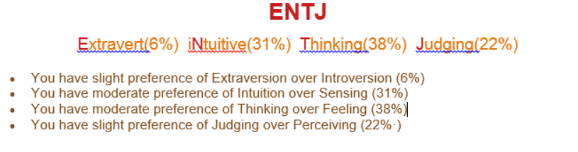</a> 
  The results of learning style test: 
 <a>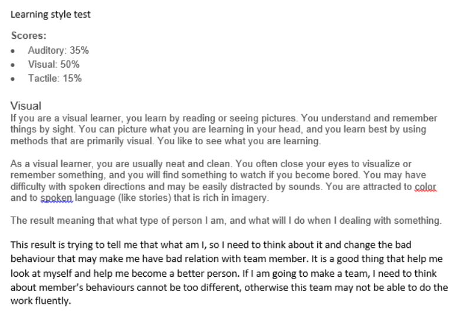</a> 
 The result of persona test: 
 <a>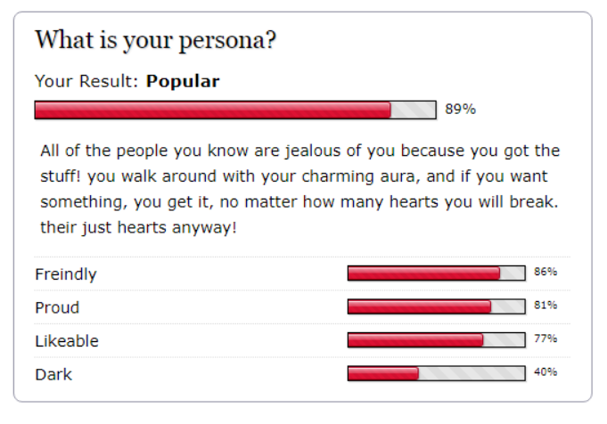</a> 
This result is trying to tell me that what I am, so I need to think about it and change the bad behaviour that may make me have bad relations with team members. It is a good thing that help me look at myself and help me become a better person. If I am going to make a team, I need to think about member behaviours cannot be too different, otherwise this team may not be able to do the work fluently.
   
  <h2>Ideal Job</h2>
  Our group members have a very wide view about their ideal job. Except Kaylee and Zijie, we all have different ideals about our future job. We are interested in different areas and focus on different skills.  
Jason wants to be an Application Developer. He think programming is a very interesting skill, he wants to have a job which let him working with softerwave. This job required some programming skills, such as JAVA and C or C++. 
Eric wants to be a Software Engineering. This job may sound a little bit like Jason’s one, but actually it still have some differences. Jason’s job mainly focus on making an application according user’s require. Eric one is deals with writing code to create a software program. A software programmer needs to know coding and excel at developing algorithms, always run tests to make sure all the codes are correct and fix bugs. This job needs a reliable development language such as Java, C#, Python, etc, SQL Server, Visual Studio, JavaScript, HTML, CSS and an excellent communication skills which can help him share his ideas with others.  
Haizhou wants to be a Data Analyst. The reason why he is interested in this job is because of after 5G come out every company need to deal with plenty of data, data may become the most important thing everyone needs to face in everyday, no matter who you are, where you live, you all need to look at different types of data and make a correct decision about how to use it. And also this job can help me learning Artificial Intelligence in the future. And this job requires a lot of skills and experience, such as strong Python and JavaScript skills, have experience with AI or machine learning and LAMP + Mongo DB blended stack. Also need some experience about AWS knowledge, and they prefer the person who graduated recently. 
Zijie and Kaylee wants to be an IT supporter, this job requires both soft and hardware knowledge. For example, Installing and configuring computer hardware, software, servers, networks and printers. Maintain and configure a Microsoft Intune MDM solution.
Patch and support endpoints/servers. Monitor and report on existing systems. Maintain and configure an office365 environment including creating accounts, groups and mailboxes. Deliver effective and efficient customer service. Support the IT Coordinator as requires. To get this role, they must have at least 1 year experience in a similar role as well as demonstrated experience maintaining and configuring Windows endpoints, Office365 and Microsoft domains. Understanding of networking (LAN, WAN, VPN and wireless networks) is included.  
Overall, Eric, Haizhou and Jason mainly focus on software skills. Zijie and Kaylee need to learn both soft and hardware skills.

<h1>Tools</h1>
<h3>The link to group’s website: https://s3701549.github.io/The-IT-World/ </h3>
<h3>The link to group’s Git repositor: https://github.com/s3701549/The-IT-World</h3>
<h3>Team members’ webpage:</h3>
Haizhou Cheng : https://ericcheng9527.github.io/COSC1078A1/ 
Eric : https://s3727607.github.io/COSC1078A1/ 
Jason : https://s3701549.github.io/COSC1078A1/ 
Kaylee : https://minhkhue0901.github.io/ 
Zijie Luo : https://damon5333.github.io/COSC1078-A1/ 

<h1>Industry Data</h1>
<h2>What are the Job Titles for your group’s ideal jobs? How do each of these rank in terms of demand from employers?</h2>
Our group has 5 members: Hai Minh Khue Ta(Kaylee), Nuozehua Li(Jason), Haizhou Cheng(Eric), Zijie Luo(Damon) and Yifei Wang. 
	For Kaylee, Job title for her ideal job is IT Support Officer, from the given Burning class data, it can be seen that from March 2017 to March 2018, the IT Support Officer is ranked 36th, there are 201 Job titles total, from the perspective of ranking, this work is highly demanded by employers. 
	For Jason, Job title for his ideal job is Application Developer, from the given Burning class data, it can be seen that from March 2017 to March 2018, the Application Developer is ranked 97th, from the perspective of ranking, this work is relatively small in terms of employers demand. 
	For Eric, Job title for his ideal job is Analyst Programmer, from the given Burning class data, it can be seen that from March 2017 to March 2018, the Analyst Programmer is ranked 70th, from the perspective of ranking, this work is relatively high demanded by employers. 
	For Damon, Job title for his ideal job is IT Support Technician, from the given Burning class data, it can be seen that from March 2017 to March 2018, the IT Support Technician is ranked 147th, from the perspective of ranking, this work is less demanded by employers. 
	For Yifei Wang, Job title for his ideal job is Software Engineer, from the given Burning class data, it can be seen that from March 2017 to March 2018, the Software Engineer is ranked 12th, from the perspective of ranking, this work is very highly demanded by employers. 
 
 
<h2>From your group’s ideal jobs, you can identify a set of skills required for these jobs </h2>
<h3>(1) How do the IT-specific skills in your required skill set rank in terms of demand from employers?</h3>
Answer: The IT-specific skills in our group that demanded by employers are Microsoft Office, VPN, Java, C, C+, Python , JavaScript, SQL Serve, HTML and CSS. As can be seen from the data given, Java and JavaScript are the skills that highly demanded by the employer. They are TOP5 skills demanded in 2017 and 2018. The other skills like Python, HTML, CSS and SQL Serve, They are the skills that most IT jobs need and are ranked in the top 20.
