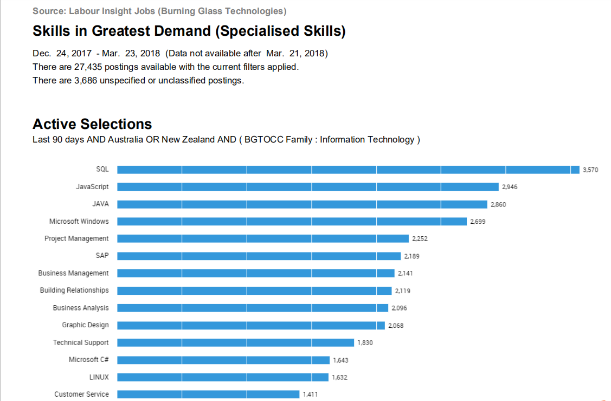
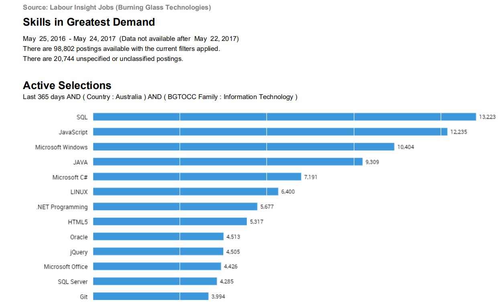
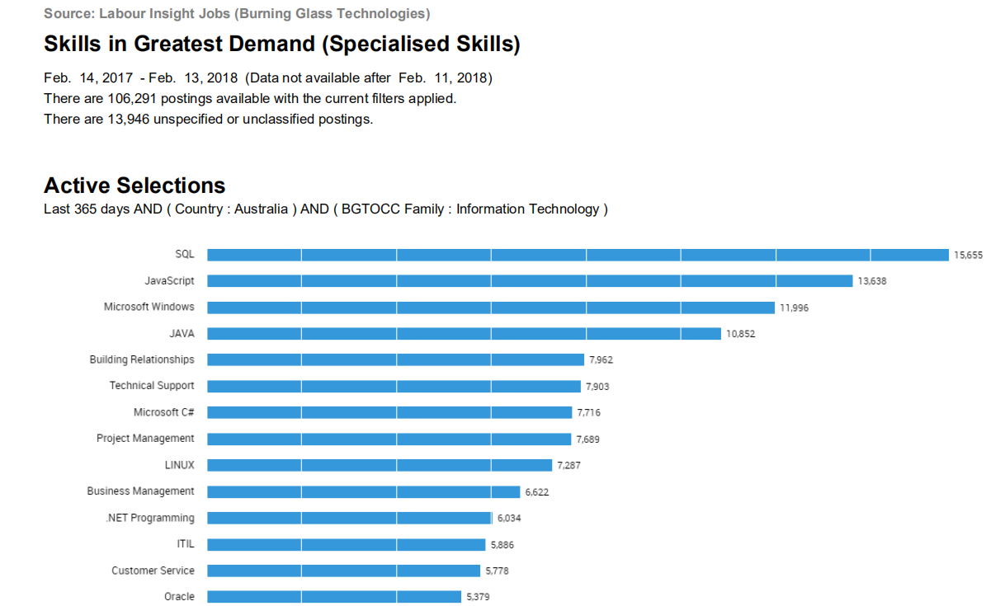
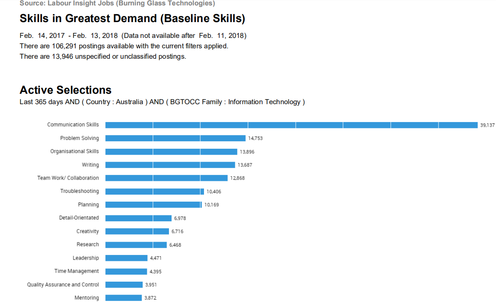
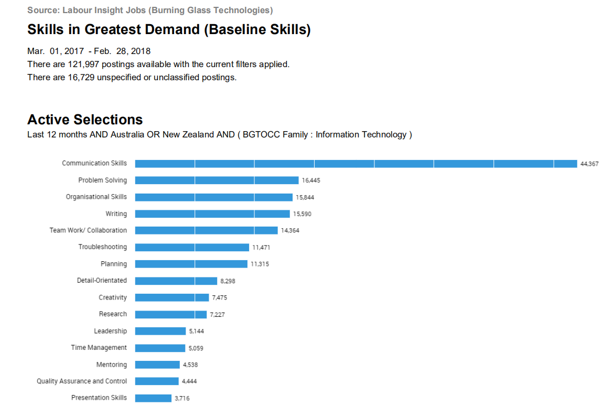
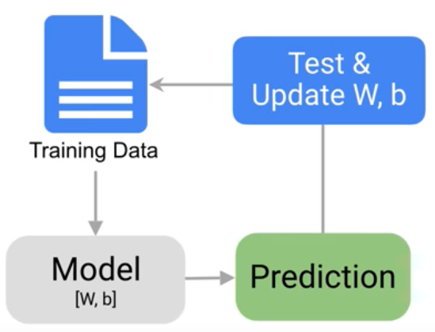

## Welcome to our IT world
<h1>1.Team Profile</h1>

Our team name called High Flash which named by Zijie Luo. Actually we don’t get it what is that meaning, but anyway it sounds good. Also it may make others easy to focus and interest in our group.

<h2>Personal Information</h2>
Name: Yifei Wang 
Student number: S3727607 
Email: 3727607@student.rmit.edu.au 
Description：I am an international student at RMIT, I have been in Australia for three years. You might know I came from China through my name, and yes I spoke Chinese. You know China has a long history, but we do use modern technical! 
 
 
Name: Nuozehua Li 
Student number: S3701549 
Email: 37015497@student.rmit.edu.au 

 
Description：I come from JiangSu China, in my hometown, there are many famous scenic spots such as natural caves and bamboo forests. 
I have been in Melbourne for a year, I graduated from diploma and start my bachelor life now. I can speak Chinese, English, but my English still not very good. About my hobbies, I like playing games in my free time. I also like listening to music when I read books, it can make me relax. 
 
 
Name: Hai Minh Khue Ta, Kaylee 
Student number: S3785151 
Email: “kaylee0901@icloud.com” 
Description: I come from Vietnam, so obviously I can speak Vietnamese. I am a freshman of Bachelor of Information Technology. I came to Australia about 3 years ago. Fun fact: I have a cat which is named Theodore and I love it. 
 
 
Name: Haizhou Cheng, Eric 
Student number: s3622097 
Email: 81996862gmail.com 
 
Description: Hi, my name is Haizhou Cheng, you also can call me Eric.I come from China, Shenzhen, which is the first economic zone in China. Because I am Chinese so my first language is Chinese, I am doing undergraduate about Information Technology in RMIT. This is my first time learning knowledge in university and also this is my first time learning something by using English. I am a person with a wide range of interests, I like sport, I can swim, play basketball, table tennis, billiards and so on. Even though I am not really good at it but still enjoy it. Also I really love card, I play all the things contain card, for example poker card game and poke card trick, magic the gathering game, Hearthstone. Next of course is video game. My favourite game is League of legend, second favourite is Blizzard game. 
 
 
Name: Zijie Luo, Damon 
Student number: s3809908 
Email: s3809908@student.rmit.edu.au 
Description: Hello everyone, let me introduce myself here briefly, I am Zijie Luo from China, you can also call me Damon, now I am studying at RMIT University, majoring in IT courses, my students number is s3809908 and the email address is s3809908@student.rmit.edu.au. If you want to make friends or have any questions, you can contact me via this email address. In fact, I have a small hobby that I especially like cats. I have three cats in China. After I came here, I also have two cats at home. I think cats are good friends of human beings. Getting along with them can make our lives full. pleasure. 
 
<h2>Team profile</h2>
<h5>Name: Zijie Luo</h5>  

 
The first test proved that I am a protector who likes to take charge of things and be enthusiastic.
The second test proved that I am a visual learner. I usually understand and learn things through vision, and I can easily attract attention with rich image colors and sounds. 
The third is an intelligence test. The result of the test is that my IQ is between 105 and 120, which is equivalent to the normal college level. 
Summarizing the results of these three tests, I am a person who can be seriously responsible in the team, will complete their tasks on time and can help others, but in the team work may be affected by other things, when forming the team I need a strong leader to supervise me, and I can be the one who helps the leader manage the team. 
   
   
  <h5>Name: Kaylee</h5> 
    1. Myers-Briggs test: Mind: Introvert 53%, Energy: Observant 54%, Nature: Feeling 65%, Tactics: Prospecting 58%, Identity: Turbulent: 64% 
    2. Learning Style test: Auditory: 25%, Visual: 40%, Tactile: 35%  
    3. Big Five Personality test: Extraversion 42%, Agreeableness 67%, Conscientiousness 84%, Neuroticism 40%, Openness 60%. 
These tests tell me what is my personality, and what is my learning type is. I am likely to be an introvert. This may affect my teamwork ability. However, this is a challenge for me to get over myself. With my conscientiousness, I will try my best to do all my work as a team. 
   
   
 <h5> Name: Jason</h5> 
  The results of an online Myers-Briggs test: 
   
  The results of an online learning style test: 
    
   The results of one further online test: 
O = Openness, C = Conscientiousness, E = Extraversion, A = greeableness, N = Neuroticism 
   
I think some opinions in the results of these tests are true for me, but not all. Maybe as the results show I’m auditory learner, so I will pay attention to this and more use this way to study in the future. The result also show I'm introverted and I admit it, this is one of the drawbacks for me, but l will try to get over it. There are all results mean for me: keep going and develop myself. 
Different people have different personalities, these personality must influence the behavior when they are working as a team; For example, I’m introverted, this will influence the team communication in a team; if you are a sense of responsibility and easy-going, people will like to work with you. 
If I’m the team manager, I will assign different tasks to people who have different personalities. If people who are outgoing, these people usually have communication and language skills, so they are Suitable to be a diplomat; If people who are introverted, these kind of people always have a sense of responsibility and work very hard in the team. So they are suitable to be a staff such as programmer. That is my opinion. 
 
 
 <h5> Name: Yifei Wang</h5> 
  
  
  
 Although these data can not represent my real person, it is indeed a reference indicator for me. In my opinion, this data allows me to understand myself more specifically. As the learning test shows, I am a visual learner. I fully agree with this point. There is no way for my subconscious to grasp the abstract things. But if it is a very specific thing, then I will remember or learn very quickly. For example, I chose IT instead of business haha! Those abstract theories are more difficult to understand and learn than actual code. 
The structure of a team is simply the leader and the team members. After the leader receives the task and discuss with the group member and then assigns the task, the leader needs experience and determination. He needs to make the right choices right away from his experience, and he can't hesitate to let the team members question the task and slow down the work. The team members need to do the assigned work well and meet the mission requirements. They cannot slow down the whole project because they are slow. This requires patience and seriousness. So I may be more suitable for team members at the moment, and carefully assign the assigned tasks.
So when teaming up, I might need to find an experienced and determined leader and do the assignment. Let me play my abilities better. 
 
 
 <h5> Name: Haizhou Cheng</h5> 
 The results of Myers-Briggs test: 
   
  The results of learning style test: 
  
 The result of persona test: 
  
This result is trying to tell me that what I am, so I need to think about it and change the bad behaviour that may make me have bad relations with team members. It is a good thing that help me look at myself and help me become a better person. If I am going to make a team, I need to think about member behaviours cannot be too different, otherwise this team may not be able to do the work fluently.
   
  <h2>Ideal Job</h2>
 All of us have different ideal jobs, except Kaylee and Zijie, they have same ideals about future jobs. We are interested in different areas and focus on different skills.  
Jason wants to be an Application Developer. He think programming is a very interesting skill, he wants to have a job which let him working with softerwave. This job required some programming skills, such as JAVA and C or C++. 
Yifei Wang wants to be a Software Engineering. This job may sound a little bit like Jason’s one, but actually it still have some differences. Jason’s job mainly focus on making an application according user’s require. Eric one is deals with writing code to create a software program. A software programmer needs to know coding and excel at developing algorithms, always run tests to make sure all the codes are correct and fix bugs. This job needs a reliable development language such as Java, C#, Python, etc, SQL Server, Visual Studio, JavaScript, HTML, CSS and an excellent communication skills which can help him share his ideas with others.  
Haizhou wants to be a Data Analyst. The reason why he is interested in this job is because of after 5G come out every company need to deal with plenty of data, data may become the most important thing everyone needs to face in everyday, no matter who you are, where you live, you all need to look at different types of data and make a correct decision about how to use it. And also this job can help me learning Artificial Intelligence in the future. And this job requires a lot of skills and experience, such as strong Python and JavaScript skills, have experience with AI or machine learning and LAMP + Mongo DB blended stack. Also need some experience about AWS knowledge, and they prefer the person who graduated recently. 
Zijie and Kaylee wants to be an IT supporter, this job requires both soft and hardware knowledge. For example, Installing and configuring computer hardware, software, servers, networks and printers. Maintain and configure a Microsoft Intune MDM solution.
Patch and support endpoints/servers. Monitor and report on existing systems. Maintain and configure an office365 environment including creating accounts, groups and mailboxes. Deliver effective and efficient customer service. Support the IT Coordinator as requires. To get this role, they must have at least 1 year experience in a similar role as well as demonstrated experience maintaining and configuring Windows endpoints, Office365 and Microsoft domains. Understanding of networking (LAN, WAN, VPN and wireless networks) is included.  
Overall, Eric, Haizhou and Jason mainly focus on software skills. Zijie and Kaylee need to learn both soft and hardware skills.

<h1>Tools</h1>
<h3>The link to group’s website: https://s3701549.github.io/The-IT-World/ </h3>
<h3>The link to group’s Git repositor: https://github.com/s3701549/The-IT-World</h3>
<h3>Team members’ webpage:</h3>
Haizhou Cheng : https://ericcheng9527.github.io/COSC1078A1/ 
Yifei Wang : https://s3727607.github.io/COSC1078A1/ 
Jason : https://s3701549.github.io/COSC1078A1/ 
Kaylee : https://minhkhue0901.github.io/ 
Zijie Luo : https://damon5333.github.io/COSC1078-A1/ 

<h1>Industry Data</h1>
<h2>What are the Job Titles for your group’s ideal jobs? How do each of these rank in terms of demand from employers?</h2>
Our group has 5 members: Hai Minh Khue Ta(Kaylee), Nuozehua Li(Jason), Haizhou Cheng(Eric), Zijie Luo(Damon) and Yifei Wang. 
	For Kaylee, Job title for her ideal job is IT Support Officer, from the given Burning class data, it can be seen that from March 2017 to March 2018, the IT Support Officer is ranked 36th, there are 201 Job titles total, from the perspective of ranking, this work is highly demanded by employers. 
	For Jason, Job title for his ideal job is Application Developer, from the given Burning class data, it can be seen that from March 2017 to March 2018, the Application Developer is ranked 97th, from the perspective of ranking, this work is relatively small in terms of employers demand. 
	For Eric, Job title for his ideal job is Analyst Programmer, from the given Burning class data, it can be seen that from March 2017 to March 2018, the Analyst Programmer is ranked 70th, from the perspective of ranking, this work is relatively high demanded by employers. 
	For Damon, Job title for his ideal job is IT Support Technician, from the given Burning class data, it can be seen that from March 2017 to March 2018, the IT Support Technician is ranked 147th, from the perspective of ranking, this work is less demanded by employers. 
	For Yifei Wang, Job title for his ideal job is Software Engineer, from the given Burning class data, it can be seen that from March 2017 to March 2018, the Software Engineer is ranked 12th, from the perspective of ranking, this work is very highly demanded by employers. 
 
 
<h2>From your group’s ideal jobs, you can identify a set of skills required for these jobs </h2>
<h3>(1) How do the IT-specific skills in your required skill set rank in terms of demand from employers?</h3>
Answer: The IT-specific skills in our group that demanded by employers are Microsoft Office, VPN, Java, C, C+, Python , JavaScript, SQL Serve, HTML and CSS. As can be seen from the data given, Java and JavaScript are the skills that highly demanded by the employer. They are TOP5 skills demanded in 2017 and 2018. The other skills like Python, HTML, CSS and SQL Serve, They are the skills that most IT jobs need and are ranked in the top 20.
   
     
       
<h3>(2) How do the general skills in your required skill set rank in terms of demand from employers? </h3>
Answer: The general skills in our group that demanded by employers are Communication, Problem Solving, Trouble Shooting and Time Management. As can be seen from the data given, Communication skill is the skill that greatest demanded by the employer, As can be seen from the data given, Communication skill is the Top 1 general skill in 2017 and 2018. the other skills like Problem Solving, Trouble Shooting and Time Management, they also are in the Top 10 general skills.
 
 
<h3>(3) What are the three highest ranked IT-specific skills which are not in your required skill set? </h3>
Answer: The three highest ranked IT-specific skills are SQL, JavaScript and Java. SQL is not in our group IT-specific skill set.
<h3>(4) What are the three highest ranked general skills which are not in your required skill set?</h3>
Answer: The three highest ranked general skills are Communication, Problem Solving and Organizational, and these three skills are all in our group general skill set.
<h2>Having looked at the Burning Glass data, has your opinion of your ideal job changed? Why or why not?</h2>
Answer: All members of the group dose not change their ideal jobs, because the ideal jobs are determined after careful consideration. These are what we really like, and we also think that these jobs will help the future, what’s more, at this stage, we don't have much work experience and IT experience, so it is a bit unrealistic to change the ideal jobs based on these data.
 
 
<h1>IT Work</h1>
<h3>We had interviewed Mr Hoai Van Nguyen, an IT developer of Vicroads.</h3>

<h4>Q: Please tell us about your IT work. What exactly you do? </h4>
A: I’m a software developer. My mainstream is web development which involves building web applications. Right now, I’m a contractor working on projects for Vicroads.  

<h4>Q: What kind of people do you interact with? Are they other IT professionals? Clients? Investors? The general public? Please tell us about them.</h4>
A: Day to day I’m interacting with other developers, team lead, testers, and business analysts as well as product owners. We are all part of an agile project team.

<h4>Q: Where do you spend most of your time? Please tell us about these.</h4>
A: Most of my time is spent in the office writing code, discussing ideas with other developers. Sometimes I also need to troubleshoot issues raised by testers, fix bugs and explain how the system works.

<h4>Q: What aspect of their position is most challenging?</h4>
A: The most challenging aspect of my job is gathering the requirements. Most of the time the business knows what they want, and we build our software accordingly. However, sometimes what they want is not really what they need. And because of that, we need to change or rebuild that causes delays and costly implementation which in turn might lead to over budget and behind schedule projects.
 
 
<h1>IT Technologies</h1>
<h2>Autonomous Vehicles</h2>

Autonomous vehicles, also known as driverless cars, computer-driven cars or wheeled mobile robots, are unmanned ground vehicles for transporting power. As an automated vehicle, autonomous vehicles can sense their environment and navigation without human intervention. Complete autonomous vehicles are still not fully commercialized, most of them are prototypes and display systems, and some reliable technologies are decentralized to mass production models, which has gradually become a reality. 
Autonomous vehicles can sense their environment with radar, optical radar, GPS and computer vision technologies. Advanced control systems convert sensory data into appropriate navigational roads, as well as obstacles and related signs. By definition, autonomous vehicles can update their map information by sensing the input data so that the vehicle can keep track of its location. 
The display system for self-driving cars dates back to the 1920s and 1930s, and the first truly autonomous car appeared in the 1980s. In 1984, Carnegie Mellon University promoted the Navlab program and the ALV program; in 1987, Mercedes-Benz and the Federal Defense University of Munich jointly promoted the Eureka Prometheus project. Since then, many large companies and research institutes have begun to produce prototypes of operational self-driving cars. After the 21st century, along with the advancement of information technology, it has been advancing by leaps and bounds. Fully-automobile vehicles have been manufactured on test vehicles. Tesla Motors is the first to introduce self-driving vehicles in specific environments. 
<h3>Development</h3>
Tucson Future Technology expects the official deployment of the fleet to begin in the second half of 2019. In addition to testing in California and Arizona, Tucson Future Technology, which was invested by NVIDIA, is also testing in Caofeidian Port and Tangcao Expressway in China, with a top speed of 90 km/h. As of March 2018, it has already tested 10,000 km.  
The Volvo Group expects to introduce a car that will prevent passengers from being injured in 2020. The Regal Group also claims that the vehicle will be able to effectively "away from the collision." 
GM, Mercedes-Benz, Audi, Regal, Nissan, BMW, Renault, Tesla and Google are all expected to launch cars that will be at least partially auto-driving by 2020. 
The goal of the Google Autopilot program is to solve all unresolved problems with today's autonomous vehicles by 2020.
Jaguar expects to launch autonomous vehicles in 2024. 
Daimler and Ford are expected to launch autonomous vehicles on the market in 2025. Ford is expected to launch its first self-driving car targeting the public but has not announced its target date. 
GM expects that most of the new cars it manufactures will have autopilot capabilities and shop floor communication technology by 2025.
IHS's car report predicts that by 2035, most autonomous vehicles will be able to operate completely independent of the control of human passengers. 
Navigant Research predicts that autonomous vehicles will gradually gain attention over the next 20 years, and by 2035, it will reach 95.4 million units per year, accounting for 75% of the overall automotive market. 
IEEE experts and scholars predict that up to 75% of vehicles will be automated by 2040. 
Some people hold the opposite view. Raj Rajkumar, director of Carnegie Mellon University's research on autonomous driving technology, said in 2014 that artificial intelligence for autonomous vehicles will not appear "very soon"; Detroit's cars Manufacturers believe that "the vision that a fully self-driving car can achieve in the short term is just a 'simple family fantasy.'" 
<h3>Potential advantage</h3>
Possible benefits of using autonomous vehicles include: 
Less traffic accidents, because autonomous vehicles do not have limited environmental sensing capabilities like human driving, but can use active and passive sensors (such as optical radar and radar) to continuously perform a wide range of sensing (such as visible light, infrared With sound waves such as ultrasonic waves, etc., with a 360-degree field of view, it can respond safely to potential crises, and its response can be more rapid than human driving. 
Avoid traffic accidents caused by human factors such as too close driving distance, distracted driving and dangerous driving.
Reduce the required safety gaps and better manage traffic flow, thereby increasing road capacity and reducing traffic congestion.
Reduce the work of vehicle passengers driving and navigation. 
Self-driving cars can have higher speed limits.
Exemption from passenger restrictions - In autonomous vehicles, there is no need to care if passengers are under-aged, old, driverless, blind, incompetent, drunk and so on. 
Relieve the shortage of urban parking spaces, because cars can allow passengers to get off the crowded area, stop at a densely populated area, stop at another location with enough parking space, and return to carry passengers when needed.
Increase car sharing and reduce the total number of vehicles, because autonomous vehicles can take passengers out of the car and carry another passenger to another place.
Reduce the physical space required for parking, so that the vehicle can only enter the parking space after driving, such as mechanical parking spaces.
Exempting Excess Passengers - Self-driving cars can be driven to the desired location, such as carrying passengers or performing maintenance, without the need for someone to be in the car. This is especially relevant for trucks, taxis and car sharing services.
Reduce the need for traffic police and car insurance costs.
Reducing physical road signs - Autonomous vehicles can receive the necessary communications electronically (although for human driving, physical signs are still required).
Smoother driving.
Because the vehicle's sensing ability is improved, theft of the vehicle can be reduced.
Removing the steering wheel and other driving interfaces saves cabin space and allows for cockpit design that does not require passengers to sit in the driver's seat.
Potential obstacle
Despite the many benefits of vehicle automation, the foreseeable challenges remain:
Liability for damages.
Individuals will resist giving up their control over the car.
Software reliability.
An inter-vehicle communication system is needed to coordinate the computer systems of individual cars, the information security of the car network, and the like.
The government must establish and implement a specific regulatory framework for autonomous vehicles.
Some drivers may not have experience if there is a need for manual driving.
Reduce job opportunities related to driving.
Loss of privacy.
For the communication between cars, more radio spectrum is needed.
Autonomous vehicles may be loaded with explosives, poisons, etc. for use as terrorist attacks.
An ethical issue like the tram problem - when the software of an autonomous car is forced to make a decision on possible damage in the event of an inevitable collision, problems can arise.
Reliability of the navigation system of the car under different weather types
Self-driving cars are functioning properly and require a very high-quality dedicated map. If these maps are out of date, autonomous vehicles must be able to return to reasonable behavior on their own.
At present, the gestures and physical functions of the police and other pedestrians cannot be recognized and understood by self-driving cars.
Current road infrastructure may need to be rebuilt for autonomous vehicles to achieve the best results. Some examples include traffic signs and streetlights that communicate with self-driving cars.
<h3>Possible influence</h3>
The Columbia University Earth Institute predicts that the total number of vehicles in the United States will be reduced to one-tenth.
PricewaterhouseCoopers predicts that the overall traffic accident will be reduced to one-tenth, and that the total number of vehicles in the United States will decline from 245 million to only 2.4 million.
KPMG and the Automotive Research Center predict that productivity and energy efficiency will improve, and new business models emerge.
Morgan Stanley predicts that autonomous vehicles can save $1.3 trillion a year in the United States, with fuel consumption accounting for $169 billion, cost of car accidents of $488 billion, and an increase in productivity of $645 billion.
<h3>Impact to people</h3>
If cars can self-driving, then I can use more vehicles in my daily life, and I don't have to worry about taking a driver's license. It is easier to plan a hike during the holidays. Taxi cars are also cheaper (because there is no labor cost). There is no longer a need to concentrate on driving and not being able to check the message or answer the call in time to delay some urgent matters. The urban environment we are in is better than the original. The self-driving cars can be driven in order. I don't have to worry if there will be drunk drivers or tired drivers who will hurt pedestrians because of his mistakes. Don't worry about family and friends. Going home too late because of traffic jams.
<h3>Reference</h3>
Self-driving car - Wikipedia 
https://en.wikipedia.org › wiki › Self-driving car 
 
 
<h2>Machine Learning</h2>
<h3>What does it do? </h3>
Machine Learning is a is the scientific study of algorithms and statistical models.  Arthur Samuels is the first person to describe his work “Machine Learning” at 1950s. Until the last few decades, people find computers have enough storage and processing power to analyze large amounts of data, after that machine learning become popular. Nowadays, machine learning has already become one of the most important subjects in the IT world. It is the core knowledge about artificial intelligence, without machine learning AI cannot work anyway. 
Machine learning is a way to help computer ‘learn’ something they cannot understand. For example what is animal, what is plant. What is the difference between a dog and a bird. What is the sun and moon. This very easy common sense are very hard to let computers understand. We cannot just tell them what is a dog, computer only can know a word make by letter D, O and G, but cannot tell you it is a dog when they see a dog. Because of that, researchers use a special way to ‘teach’ machine. They give a special program a lot of data about bird and dog by telling them birds and dogs characteristics and appearance. For example, dogs have 4 legs but birds only have 2, dogs have hair at all of their body but birds have feathers, dogs walking on land but bird flying in the sky. All of this different appearance can ‘teach’ computer and help it tell the correct answer when researcher show a dog image and a bird image in front of it. It sounds very easy, but if you suddenly show a dog image and a cat image in front of the computer, it has a high percentage shows the wrong answer. Because cats and dogs have very similar appearance for computer. So researchers need to keep giving computer plenty different types of data to make sure it will not make any mistakes in one area. 
 
Nowadays, machine learning have improving faster and faster. We can see AI in many different areas. Simply put, AI is a smart program which can help you predict the future by using big amount of data. For example, what is tomorrow’s weather, how is the economic future, when do you need to go out to catch the bus, what is the best way to go to school, what is your favourite cola brand and where can you buy it’s cola. Because of this powerful skill, AI will occupy a large number of jobs, all boss will like the employer who can do everything you order perfect and will not feel tired, work 7 days per week, don’t need any holiday and take very low salary. Not only change the work market, but also change our daily life. In recent 3 years, some city people will not need to drive by themselves, Autonomous vehicles will become mainstream. People don’t need to go to the supermarket by themselves, your fridge will take care of it. Card bag will be history, nfc is better. Still worried about junk email and Harassing phone call? Don’t worry, your phone will take care of it. All the things I mentioned above needs a powerful AI and machine learning is a part of AI. 
 
<h3>What is the likely impact? </h3>
Machine learning already make a very strong impact to the world. More and more people realise how ‘smart’ can computer be. In people’s mind, the computer is not a tool, it's more like a partner. The high technology makes people become lazy. We don’t want to do everything by ourselves, we long for others do things for us. In this area, machine have very good talent. People just need to let program access their daily data and then program will easily understand what is your favourite. That is what happen on our electronic device all the time. Amazon and ebay use the data from our google search history to learn what we want, and then next time when we open Amazon or ebay, they will show the things we search at the top of the page. 
Every coin has two sides, machine learning also give our social some bad influence. Because its powerful calculate speed and smart way of learning. More and more common job, such as factory workers and travel guide already have been replaced by artificial intelligence. In addition some dangers work also have been replaced. Robot with AI can do plenty thing we cannot image before. 
 
<h3>How will this impact us?</h3>
The machine learning will change our job needs. By then, the waiters in the restaurant, the secretary of the office, the police on the road, the nanny at home, etc. will all be replaced by AI machines. Those simple jobs will gradually disappear, and only leaving careers that require creative thinking for people. Similarly, machine learning affects people's way of thinking. Because human knowledge is limited, but machines are infinite. When we believe and rely on the judgment and decision of intelligent machines, people become lazy and lose the ability to think actively because they don't need it! 
If this really comes true, our life will be relatively easier, and most of the work will be handed over to the machine. But at that time, what kind of occupation can we survive? When the work of the family is replaced by the machine, what kind of attitude will the people hold on the smart machine? This need to be considered! 
<h3>References</h3>
Guo, Y. (2019). The 7 Steps of Machine Learning (AI Adventures). [online] YouTube. Available at: https://www.youtube.com/watch?v=nKW8Ndu7Mjw [Accessed 19 Sep. 2019]. 

 Meserole, C. (2019). What is machine learning?. [online] Brookings. Available at: https://www.brookings.edu/research/what-is-machine-learning/ [Accessed 19 Sep. 2019]. 
  
 <h2>Cybersecurity</h2>
 <h3>What is it?</h3>
 Cybersecurity refers to the hardware of the network system, the data in the software and its system are protected, and it is not damaged, changed or leaked due to accidental or malicious reasons. The system runs continuously and reliably, and the network service is not interrupted. It has the following features:
 <h4>Confidentiality</h4>
 Information is not disclosed to unauthorized users, entities or processes, or features that are available to them.
  <h4>Integrity</h4>
  The feature that data cannot be changed without authorization. That is, the information remains unmodified, uncorrupted, and lost during storage or transmission.
   <h4>Availability</h4>
   A feature that can be accessed by an authorized entity and used on demand. That is, you can access the information you need when you need it. For example, in the network environment, denial of service, damage to the network, and the normal operation of the system are all attacks on usability.
    <h4>Controllability</h4>
    Control over the dissemination and content of information.
    <h4>Auditability</h4>
    Provide evidence and means when security issues arise
     
     
    From the perspective of network operation and management, it is hoped that access to local network information, read and write operations, etc. are protected and controlled, avoiding "trapdoors", viruses, illegal access, denial of service, illegal use of network resources, and illegal control. Threat, stop and defend against attacks by network hackers. For the security and confidentiality departments, they hope to filter and prevent illegal, harmful or state-confidential information, avoid confidential information leakage, avoid harm to society, and cause huge losses to the country.    
With the rapid development of computer technology, the business processed on the computer has also evolved from single-machine mathematical operations, file processing, internal business processing based on simple connection internal network, office automation, etc. to complex intranets and enterprises. Extranet, enterprise computer processing systems for the Internet and worldwide information sharing and business processing.    
As the system's processing power increases, the system's connectivity is constantly improving. However, while the connection capability information and the circulation capacity are improved, the security problem based on network connection is also becoming more and more prominent. The overall network security is mainly manifested in the following aspects: physical security of the network, security of the network topology, security of the network system, application system. Security and security of network management, etc.    
Therefore, the computer security problem should be the same as the fire and theft prevention problem of each household. Even when you don't think that you will become a target, the threat has already appeared. Once it happens, it is often caught off guard and causes great losses.    
<h3>What is the impact?</h3>
Network security issues are related to the in-depth development of future network applications, including security policies, mobile code, command protection, cryptography, operating systems, software engineering, and network security management. The isolation of a generally private intranet from the public Internet primarily uses "firewall" technology.   
“Firewall” is an image. In fact, it is a combination of computer hardware and software that establishes a security gateway between the Internet and the intranet to protect the intranet from unauthorized users.  
The ability to complete the "firewall" work can be a simple covert router. This "firewall" can only provide a kind of isolation if it is a normal router. Concealed routers can also block inter-network or host-to-host communication at the Internet Protocol port level, providing some filtering. Since the covert router only makes some modifications to the parameters of the router, some people do not classify it as a "firewall" level.  
There are two types of "firewalls" that are truly meaningful. One is called a standard "firewall"; the other is called a dual-home gateway. The standard "firewall" system consists of a Unix workstation with a router at each end for buffering. The interface of one of the routers is the external world, that is, the public network; the other is connected to the internal network. The standard "firewall" uses specialized software and requires a high level of management, with a certain delay in the transmission of information. The dual-home gateway is an extension of the standard "firewall". The dual-home gateway, also known as the bastion host or application-layer gateway, is a single system, but it can perform all the functions of the standard "firewall" at the same time. The advantage is that it can run more complex applications while preventing any direct connections between the Internet and the internal system, ensuring that packets cannot reach the internal network directly from the external network, and vice versa.  
With the advancement of "firewall" technology, two "firewall" configurations have evolved on the basis of dual-home gateways, one is a hidden host gateway, and the other is a hidden intelligent gateway (hidden subnet). A hidden host gateway may currently be a common "firewall" configuration. As the name implies, this configuration hides the router on the one hand and the bastion host between the Internet and the intranet on the other hand. The bastion host is installed on the internal network. Through the configuration of the router, the bastion host becomes the only system for the intranet to communicate with the Internet. At present, the most complicated and safest "firewall" is the hidden intelligent gateway. The so-called hidden intelligent gateway hides the gateway behind the public system, and it is the only system that Internet users can see. All Internet functions are carried out through this protection software hidden behind the public system. In general, this "firewall" is the least vulnerable to damage.  
The security technology used in conjunction with the "firewall" is data encryption technology. Data encryption technology is one of the main technical means used to improve the security and confidentiality of information systems and data, and to prevent secret data from being destroyed externally. With the development of information technology, network security and information secrecy have attracted more and more attention. In addition to strengthening the security protection of data in law and management, countries have taken measures in software and hardware to promote the continuous development of data encryption technology and physical prevention technology. According to different functions, data encryption technology is mainly divided into four types: data transmission, data storage, data integrity authentication and key management technology.  
Another technology closely related to data encryption technology is smart card technology. A smart card is a medium of a key, generally like a credit card, held by an authorized user and given a password or password by the user. This password is the same as the password registered on the internal web server. When the password is used together with the identity feature, the security performance of the smart card is still quite effective.  
  
   
  <h3>What will impact to people?</h3>
  The Internet is a double-edged sword: in the hands of ordinary people, it is convenient for the acquisition and dissemination of information; and in the hands of people with ulterior motives, it has become a tool for infringing on the interests of the people.
And hacker is the type of ulterior! Last year, a computer virus called "Blackmail Virus" was spread throughout the Internet in the form of mail, Trojan horses, and web pages. Once the user file is infected, it is locked, and the decrypted private key must be obtained to be possible to crack. The way to get the private key is to pay for unlocking, which is equivalent to "blackmail." This virus poses a serious threat to both user property and mobile phone security. 
There are also some low-level life rumors that have an impact on people's healthy lives. For example, "a pack of instant noodles, the liver needs to be detoxified for one month", "diabetes no longer need to take medicine for injection", "severe chest pain immediately take nitroglycerin and aspirin" ... such unscientific information spread in the crowd, if anyone The conviction is not serious, the consequences will be very serious, the light cause the disease delay, the heavy one may be life-threatening. 
In short, in this information age, cybersecurity will greatly change our lives and avoid the above things. It can also bring convenience to our lives. For example, we no longer need to use heavy safes to store important documents or materials, and it is more convenient and safer to store on the network disk. You don't have to carry a heavy wallet when you go out, and electronic payment is faster and more convenient. Filling in personal information on the Internet without fear of being stolen by criminals. 
<h3>References</h3>
Computer security-Wikipedia
https://en.wikipedia.org/wiki/Computer_security 

What is Cybersecurity? – Definition from Whatls.com https://searchsecurity.techtarget.com › definition › cybersecurity 
 
 
<h2>Robots</h2>
<h3>What is it?</h3>
Robots include everything that simulates human behavior or thoughts and simulates other creatures (such as robotic dogs, robot cats, etc.). There are many classifications and controversies in the definition of robots in the narrow sense. Some computer programs are even called robots. In contemporary industry, robots refer to man-made machine equipment that can automatically perform tasks to replace or assist humans, usually mechanical and electrical equipment, controlled by computer programs or electronic circuits. 

The scope of the robot is very wide, and it can be autonomous or semi-autonomous. It can be anthropomorphic robots such as ASIMO from Honda's technical industry or TOPIO from TOSY, and industrial robots. It also includes multiple robots that work together.  By mimicking realistic appearance and automated movements, the ideal high-simulation robots are the product of advanced integrated cybernetics, mechatronics, computer and artificial intelligence, materials science and bionics, and the current scientific community is researching and developing in this direction. The topic of robots is common in science fiction. 

Robotics is a technical study on the design, assembly, operation and application of robots, as well as computer systems for controlling robots, sensor feedback and information processing. Robots can replace humans in some dangerous environments or manufacturing processes, or replace humans in appearance, behavior, or cognition. Many machine concepts come from nature, so there is the emergence of bionic robotics. 

Robots can do some repetitive or dangerous work, humans do not want to do the work, but also can do some work that humans can't do because of size restrictions, even in an environment like outer space or deep sea, which is not suitable for human existence. There are some doubts about more and more robots and their roles in society. Because robots can replace human beings in more and more aspects, they are considered to be one of the main reasons for increasing the number of unemployed people. The robots used in the war also have moral doubts. The possibility of robot autonomy and its influence is one of the themes of science fiction, and it may become a problem that will actually occur in the future. 
<h3>Asimov Robot's Three Laws</h3>
Imagined robots’ renegade humans
The description of robot behavior in science fiction is best known by the science fiction writer Essa Asimov's "Three Laws of Robots" in the novel "I, Robot". The three "laws" that Asimov proposed for robots, procedurally stipulated that all robots must comply with: 
The first rule: robots must not harm humans and ensure that humans are not harmed; 
The second rule: Under the premise of not violating the first rule, the robot must obey the command of human beings; 
The third rule: robots must protect themselves without violating the first and second rules. 
The purpose of the "Three Laws of Robots" is to protect humans from harm, but in the novel, Asimov also explores the possibility of harming human beings without violating the three laws, and even constantly challenging these three laws in the novel. Find many vulnerabilities in the law that looks perfect. In reality, the "three laws" become the basis of mechanical ethics. 
<h3>Robots that are already in existence or under development, and their impact Contemporary application robot</h3>
Nowadays, for humans, work that is too dirty, too dangerous, too fine, too heavy or too boring is often done by robots. Many of the mission-oriented robots are used in production lines in manufacturing plants. Other applications include injection molding, construction, oil drilling, ore mining, space exploration, underwater exploration, poisoning material cleanup, search and rescue, medicine, Military field, etc. 
<h4>Welding Robot</h4>
Welding robots are the most common type of industrial robots and are commonly used in the large-scale manufacturing of automotive manufacturing machinery lines, in the welding of automotive bodies and other parts that use welding processes.
<h4>Painting robot</h4>
Painting robots are also the most common type of industrial robots and are often used to paint on car bodies.
<h4>Combat robot</h4>
The countries that are at the forefront of combat robot research and development include the United States and Israel. If you do not include all kinds of unmanned aircraft in service around the world, the typical case is DRDO (Defense Research and Development Organization) company Daksh, iRobot PackBot, Foster-Miller's "claw", Israel's USV (Unmanned Security Vehicle) company's Guardium, South Korea's Samsung's SGR-A1. 
Current combat robots have been used in local wars such as Afghanistan and Palestine-Israel conflicts. Common tasks include reconnaissance, mine clearance, etc. These robots are often very flexible and can travel through complex terrain such as BigDog and Atlas of Boston, USA. Some models of robots are equipped with offensive weapons such as machine guns. 
<h4>Scientific research robot</h4>
It is often used to explore places that are difficult for humans to access safely or simply. There are underwater robots, extraterrestrial exploration robots (Courage, Opportunity), cave/closed room exploration robots, volcano research robots, space exploration robots, and so on.
<h4>Human body robot (semi-robot)</h4>
See also: semi-robot
Some humans will be transformed into robots through surgery, inputting their own consciousness into the computer, etc., for the purpose of maintaining law and order, military battles and so on.
<h4>Pet, doll robot</h4>
Robots can also be used as entertainment toys and even become pets and companions in human life. The "BeRobot Humanoid Robot" launched by Taiwan's Extremely Interesting Technology Co., Ltd. and the "Aibo" robotic pet launched by Sony Corporation of Japan are actual cases. Some Japanese areas have already used children's body robots for reception.
<h4>Industrial robot</h4>
Refers to an electromechanical integration production equipment consisting of an operating machine (mechanical body), a controller, a servo drive system and a sensing device, which can be used for human-like operation, automatic control, reprogrammable, and can perform various operations in three-dimensional space. It is especially suitable for multi-variety and variable-volume elastic manufacturing systems. 
An industrial robot can only include a link between a feeling and an action, and this link is not manually manipulated by a person. The action of the robot may be the action of an electric motor or a driver (also called an effector) moving one arm to open or close a clip. Such direct and detailed control and feedback may be provided by programs running on external or embedded computers or microcontrollers. According to this definition, all automatic devices count as robots. 
Industrial robots can directly accept human commands, run pre-programmed programs, or act on principles that are based on artificial intelligence techniques. 
In terms of the development status of industrial robots, 114,365 new industrial robots were installed in the world in 2007, an increase of 3% compared with 111,052 newly installed in 2006. By the end of 2007, the number of industrial robots in the world had reached 995,000 units. In 2007, the assembly volume of industrial robots in Asia and the Americas increased significantly. The development of the automotive industry and the electronics industry was a major factor in the strong growth of industrial robot assembly in the above regions. In addition, the demand for industrial robots for the chemical industry has also increased rapidly. 
<h3>Their impact to human</h3>
Robots can replace people's physical labour and some special occupations of people. It will cause some people to change their work types and even cause losing job. On the one hand, people hope that robots can replace human beings for various kinds of labour, and on the other hand, they are worried that their development will cause new problems. In fact, the social structure is undergoing a quiet change in the past decade or so. The social structure of "human-machine" will eventually be replaced by the social structure of "human-robot". Nowadays and many future jobs that are originally undertaken by people will be handled by robots. Therefore, people will have to learn to get along with intelligent machines and adapt to this changing social structure.

<h3>Reference</h3>
Robot - Wikipedia 
https://en.wikipedia.org › wiki › Robot 
 
<h1>Project ideal</h1>
En.wikipedia.org. (2019). Black Mirror. [online] Available at: https://en.wikipedia.org/wiki/Black_Mirror [Accessed 20 Sep. 2019]. 
<h2>Overview</h2>
The project which I am interested and think it may become the innovation of IT is AI manager. This idea comes from filmography--<"black mirror">. There have one episode is talking about copy people's mind data and use this data to build a self-make AI which know everything about you and can serve you about everything in your life. But the way which use in film is inhuman and also very difficult to achieve. But AI manage not have ethical issues and easy to achieve by using technology.
<h2>Description </h2>
This project has very high potential in, because it is a brand new technique for human beings. It looks like virtual assistance such as siri and cortana, but more powerful and smart. This assistance is a program, which can help users control their information and data. It has very strong privacy and independence,every personal assistance only work on personal’s device. Only receive data from the internet and will not send any data to the internet. This assistance have two main functions. Analysis data and keep user’s information safe. It can help user to check all the unread messages, email and phone calls. Then seperate it to different topic, addresser, time and type. Also can able to identify the junk message and email. Can remind the user check important or hurry mail and send the feedback on time. Second is to keep user’s data and property safe. Assistance control all the money transfer, every transfer need have E-receipt or reason why. Otherwise the transfer will be rejected. Also assistance will access user’s contacts book, if others want to ask you borrow money, assistance will check his/her credit history and tell you the risk of this transfer(user cannot see the credit data). Also assistance can locate user’s location, if user’s consumption is not near his/her location, this assumption may be rejected.
<h2>Technology</h2>
In order to achieve successful running this software, we need to let the program know how to identify different types of data and learn what is it’s owner want. So we need to use a technology called machine learning. Machine learning is the way to teach a program learn new things or able to identify different things. We need to use this skill and make a program that can understand user after they analyze large amount of user’s data. In addition, user can teach AI assistance the thing he/she think is suited to them. That can achieve full customised design, everyone’s assistance is different and suitable. Because we want AI assistance be safe and privacy and program has the ability to deal with large amount of data, so user need to have an independent chassis as base station which can analyze and store data.
<h2>Advantages</h2>
This project can bring many benefits to human beings. It can not only provide convenience and help in people's daily life, but also have good impacts on the whole society and the world. First of all, it can adjust some small details in your life according to your usual personal habits, improve your quality of life, for example, it can collect the habits of your usual eating and analysis, then summarize what kind of nutrition you need, and finally give a complete set of recipes to remind you to have healthy diets. Secondly, it can also use algorithms to figure out the possibility of the next disaster, and prepare for prevention in advance, such as a disaster just happening in a region (natural disasters, such as earthquakes, floods), which can be based on the location of the place, disasters that have occurred in history and various data to determine when disasters will occur in the future, and then give a preventive measure. This can effectively reduce the casualty rate.(Vyas, 2018). There are many other benefits, such as improving work efficiency, saving human resources, reducing the probability of errors, and more importantly, artificial intelligence can overcome human limitations and can be an important asset for our future progress.(AI Trading). Therefore, human beings can get lots of profits from this project.
<h2>Drawbacks</h2>
Artificial intelligence is like a double-edged sword. When it brings benefits, it will also bring disadvantages in some aspects. This project could have some bad impacts on human beings and the society. Firstly, It will lead to a serious polarization between the rich and the poor, When AI replaces most of the labor force, it will lead to a significant increase in unemployment, and companies that master AI technology will be full of money in the process. At the same time of massive unemployment, wealth is quickly and concentrated in the hands of a few. Secondly, if this project is used by criminals, it will seriously harm people’s safety. Secondly, if this project is used by criminals, it will seriously harm personal safety. For example, people with evil intentions can buy unmanned aerial vehicles and train them with face recognition software to enable them to search and attack specific targets, or let robots automate operations, create and publish fake videos to manipulate public opinion for political purposes.(TMUOAI). Therefore, we should use it in a right way.
<h2>Reference lists</h2>
1.Kashyap Vyas.(2018). 7 Ways AI Will Help Humanity, Not Harm It  [online]Available at<https://interestingengineering.com/7-ways-ai-will-help-humanity-not-harm-it> viewed at 20/09/2019. 

2.Ten benefits of artificial intelligence(2018)  [online]Available at<https://medium.com/@aitrading/%E4%BA%BA%E5%B7%A5%E6%99%BA%E8%83%BD%E7%9A%84%E5%8D%81%E5%A4%A7%E5%A5%BD%E5%A4%84-92e0305604f8> viewed at 20/09/2019. 
3.The Malicious Use of Artificial Intelligence: Forecasting, Prevention, and Mitigation (2018) [online]Available at<https://maliciousaireport.godaddysites.com/> viewed at 20/09/2019. 
 
 
<h1>Group Reflection</h1>
We summarized the following points that our group did well. Firstly, there are five people in the group, and each member is responsible for one part, so our work efficiency has been improved. Secondly, we have good communication, we set up a communication group on WeChat, it saves us a lot of time because we don’t need to talk with each other face to face, we share our opinions and according to this for perfection our work. However we still have something need to improvement, such as we spent long time to finish this assignment. the main reason is we don’t use online editing tools such as google diver, so we can’t know everyone’s opinion on time, we should ask them on the communication group. The other thing we should ameliorate is sometimes we didn’t attend class, that made us don’t know each member’s work progress, this is the other reason why we spent long time in this assignment. There are many things that we were surprising. For example: The person who responsible for the IT Technologies, he looks for a lot of information about that and spent a long time to finish this part. And we have a nice project ideal, it comes from Haizhou Cheng, they all good team member in this group. Each team member also have the same hobbies such as play games and watch anime, that's really a coincidence for us. There are many things that we have learned about groups is Communication among team members is very important, that easy to know everyone’s work process and made the necessary changes. We also learned that group work is not easy. We need to learn how to work with the stranger and consider their temper. Before we do the assignment, The full preparation, good communication and clear division of labor, which will help us deal with group work well in the future. There all important for the team work.

